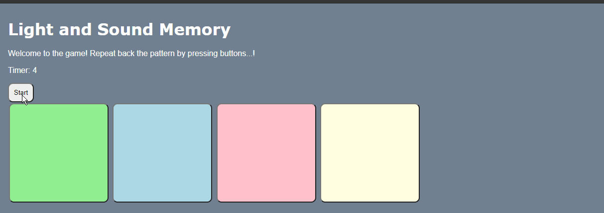

# Pre-work - *Memory Game*

**Memory Game** is a Light & Sound Memory game to apply for CodePath's SITE Program. 

Submitted by: **Joseph Dang**

Time spent: **3** hours spent in total

Link to project: (https://glitch.com/edit/#!/tangy-delightful-screen)

## Required Functionality

The following **required** functionality is complete:

* [X] Game interface has a heading (h1 tag), a line of body text (p tag), and four buttons that match the demo app
* [X] "Start" button toggles between "Start" and "Stop" when clicked. 
* [X] Game buttons each light up and play a sound when clicked. 
* [X] Computer plays back sequence of clues including sound and visual cue for each button
* [X] Play progresses to the next turn (the user gets the next step in the pattern) after a correct guess. 
* [X] User wins the game after guessing a complete pattern
* [X] User loses the game after an incorrect guess

The following **optional** features are implemented:

* [ ] Any HTML page elements (including game buttons) has been styled differently than in the tutorial
* [ ] Buttons use a pitch (frequency) other than the ones in the tutorial
* [ ] More than 4 functional game buttons
* [ ] Playback speeds up on each turn
* [ ] Computer picks a different pattern each time the game is played
* [ ] Player only loses after 3 mistakes (instead of on the first mistake)
* [ ] Game button appearance change goes beyond color (e.g. add an image)
* [ ] Game button sound is more complex than a single tone (e.g. an audio file, a chord, a sequence of multiple tones)
* [X] User has a limited amount of time to enter their guess on each turn

The following **additional** features are implemented:

- [ ] List anything else that you can get done to improve the app!

## Video Walkthrough

Here's a walkthrough of implemented user stories:

## Reflection Questions
1. If you used any outside resources to help complete your submission (websites, books, people, etc) list them here. 
GeeksforGeeks, Stackoverflow

2. What was a challenge you encountered in creating this submission (be specific)? How did you overcome it? (recommended 200 - 400 words) 
One challenge I encountered was trying to implement the timer function. My logic for the timer is: whenever the player is able to guess the pattern correctly, then the timer would reset back to the original time. When I ran the project, I realized that the timer kept increasing and increasing. It would eventually go so fast that the player was not able to react fast enough to click the buttons. I looked through the documentation and realized I had to clear the interval. When I cleared the interval it became a lot better and managable. I also had issues with the order of the code. At first, I placed the update timer function below the guessCounter++. This was a mistake since it would keep updating the timer every time the user had made a guess. The fix for this is to put it after the user had correctly guessed the sequence. After doing that, the timer was able to reset every time the user got the sequence right, instead of after every guess.

Another issue I had was with the frontend work. When I ran my project for the first time, the clue sequence would not light up. Starting the game would not show the player what button to click. My first reaction was to check the Javascript. After thorough inspection, I realized that the Javascript was not the issue. I looked in the CSS file and realized that I forgot the #button.lit. So, I just added that and my project finally worked. Since frontend is not my strong suit, I thought my mistake was just in the backend. I should have made sure the HTML and CSS was right.

3. What questions about web development do you have after completing your submission? (recommended 100 - 300 words) 
I had questions about the overall workflow of web development. Whenever I try to start any coding project its extremely hard for me to write the first couple of lines. In this project, writing a HTML, CSS, JS file seems too much to think about. So, how should I manage my workflow? Whenever I look at other website's HTML through inspect element, I find it really hard to make sense of it all. After that, I realized that I would also have to make more complex HTML and CSS files. How do I become better at keeping track of what I write? Also, how can I find the smaller bugs in my websites? From the previous question, I wrote how I found my mistake in the CSS file, and not the Javascript file. How do I become better at debugging and finding bugs with three files?

4. If you had a few more hours to work on this project, what would you spend them doing (for example: refactoring certain functions, adding additional features, etc). Be specific. (recommended 100 - 300 words) 
One function I wanted to refactor is the timer. I had better ideas to program it, but trying to implement it turned out harder than expected. My idea was that, once the clue sequence finishes, the timer would start. Right now, the timer starts even when the clue sequence is going on. The player loses a lot of time, since they need to let the pattern finish first. Meanwhile, one idea I had is an infinite playthrough. Instead of ending when the sequence is finished, the player continues the sequence until they lose. I would implment a score method as well to keep track of how far the player got. I would also love to spruce my game up more. The game is extremely bare bones. I would implement a main menu, game screen, and lose screen. The lose screen would say how many points the player got as well.

## License

    Copyright Joseph Dang

    Licensed under the Apache License, Version 2.0 (the "License");
    you may not use this file except in compliance with the License.
    You may obtain a copy of the License at

        http://www.apache.org/licenses/LICENSE-2.0

    Unless required by applicable law or agreed to in writing, software
    distributed under the License is distributed on an "AS IS" BASIS,
    WITHOUT WARRANTIES OR CONDITIONS OF ANY KIND, either express or implied.
    See the License for the specific language governing permissions and
    limitations under the License.
